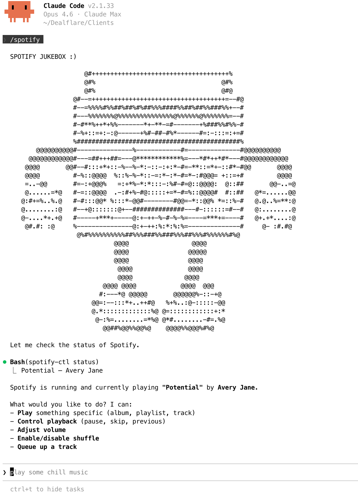

# Claude Code Spotify Jukebox



Headless Spotify for macOS — music plays, media keys work, Control Center shows the track, and no app window ever appears.

## What it looks like

Tell Claude Code what you want to hear:

```
> play something chill

Starting Spotify... Playing "Khruangbin - Time (You and I)"
♫ Now playing in Control Center. Media keys work.
```

```
> play miles davis bitches brew

Playing "Miles Davis - Bitches Brew"
```

```
> I'm in a deep focus coding mood

Playing "Brian Eno - Music for Airports"
```

```
> play something really obscure, 80s foreign, hazy nocturnal saxophone

Playing "Yasuaki Shimizu - Kakashi"
```

Claude searches for the Spotify URI, starts the daemon if needed, and plays it — all without leaving your terminal.

## What you get

- **Media keys** — play, pause, next, previous all work from your keyboard
- **Control Center** — track info and controls show up in the macOS Control Center widget
- **Lock Screen** — album art and playback controls on the Lock Screen
- **Album art** — displayed everywhere macOS shows Now Playing info
- **No app window** — nothing steals focus, no dock icon, no menu bar item
- **On-demand** — `spotify-ctl start` brings it up, `spotify-ctl stop` kills it, nothing runs on boot

## Architecture

```
Spotify servers ←→ go-librespot (daemon) ←→ CoreAudio (AudioToolbox)
                          ↑
                   localhost:3678 (HTTP API)
                          ↑                        Media keys
                 curl / Claude Code ←——→ NowPlayingBridge ←——→ macOS Now Playing
                                           (Swift bridge)       Control Center
                                                                Lock Screen
```

Two processes, started on demand:

1. **[go-librespot](https://github.com/devgianlu/go-librespot)** — an open-source Spotify Connect client in Go. Authenticates directly with Spotify's backend, decodes audio, and outputs through macOS AudioToolbox (CoreAudio). No Electron, no browser, no GUI. Exposes an HTTP API on `localhost:3678`.

2. **NowPlayingBridge** (included in this repo) — a lightweight Swift process that bridges go-librespot to macOS. It polls the status API, registers with `MPRemoteCommandCenter` and `MPNowPlayingInfoCenter`, and proxies media key events back to go-librespot. Runs as an invisible accessory app — no dock icon, no menu bar.

## Install

### Prerequisites

- macOS (Apple Silicon or Intel)
- Spotify Premium account
- [Go](https://go.dev/dl/) toolchain
- [Xcode](https://apps.apple.com/app/xcode/id497799835) (Command Line Tools alone won't work — the MediaPlayer framework and matching SDK are only available with full Xcode)

### 1. Clone this repo

```bash
git clone https://github.com/YOUR_USER/headless-spotify-macos.git
cd headless-spotify-macos
```

### 2. Build go-librespot

```bash
git clone https://github.com/devgianlu/go-librespot.git
cd go-librespot
go build -o go-librespot ./cmd
cd ..
```

This clones go-librespot inside the repo directory (it's gitignored).

### 3. Build NowPlayingBridge

```bash
cd NowPlayingBridge
swiftc -O -framework MediaPlayer -framework AppKit -o NowPlayingBridge Sources/main.swift
cd ..
```

If this fails with an SDK mismatch error, make sure Xcode is selected:

```bash
sudo xcode-select -s /Applications/Xcode.app/Contents/Developer
sudo xcodebuild -license accept
```

### 4. Configure go-librespot

```bash
mkdir -p ~/Library/Application\ Support/go-librespot
```

Create `~/Library/Application Support/go-librespot/config.yml`:

```yaml
device_name: "Headless Spotify"
device_type: computer
audio_backend: audio-toolbox
bitrate: 320
credentials:
  type: interactive
zeroconf_enabled: false
server:
  enabled: true
  address: localhost
  port: 3678
```

`audio_backend: audio-toolbox` is the key line. Without it, silent playback on macOS.

### 5. Authenticate (first run only)

Quit the Spotify desktop app, then:

```bash
cd go-librespot && ./go-librespot
```

This opens a browser for Spotify OAuth. After login, credentials are cached and future starts are automatic. Kill it with `Ctrl+C` once authenticated.

### 6. Add spotify-ctl to your PATH

```bash
ln -s $(pwd)/spotify-ctl.sh /usr/local/bin/spotify-ctl
```

Or wherever you keep local scripts.

## Usage

```bash
spotify-ctl start    # Launch go-librespot + NowPlayingBridge
spotify-ctl stop     # Kill both
spotify-ctl status   # Show what's playing
```

### Playing music

```bash
# Play by Spotify URI
curl -s -X POST http://localhost:3678/player/play \
  -H 'Content-Type: application/json' \
  -d '{"uri": "spotify:track:TRACK_ID"}'

# Play/pause
curl -s -X POST http://localhost:3678/player/playpause

# Next / previous
curl -s -X POST http://localhost:3678/player/next
curl -s -X POST http://localhost:3678/player/prev

# Volume (0-100)
curl -s -X POST http://localhost:3678/player/volume \
  -H 'Content-Type: application/json' \
  -d '{"volume": 50}'

# Shuffle
curl -s -X POST http://localhost:3678/player/shuffle_context \
  -H 'Content-Type: application/json' \
  -d '{"shuffle_context": true}'

# Queue a track
curl -s -X POST http://localhost:3678/player/add_to_queue \
  -H 'Content-Type: application/json' \
  -d '{"uri": "spotify:track:TRACK_ID"}'

# Seek (milliseconds)
curl -s -X POST http://localhost:3678/player/seek \
  -H 'Content-Type: application/json' \
  -d '{"position": 30000}'

# Current status
curl -s http://localhost:3678/status
```

### Spotify URIs

Extract from any `open.spotify.com` URL:

```
https://open.spotify.com/track/6qtTjd9flEojIS9sXpX72Y → spotify:track:6qtTjd9flEojIS9sXpX72Y
https://open.spotify.com/album/3Q0zkOZEOC855ErOOJ1AdO → spotify:album:3Q0zkOZEOC855ErOOJ1AdO
```

### Custom paths

If your go-librespot binary isn't inside this repo directory, create a config file:

```bash
mkdir -p ~/.config/headless-spotify
cat > ~/.config/headless-spotify/config << 'EOF'
LIBRESPOT_BIN="/your/path/to/go-librespot"
LIBRESPOT_DIR="/your/path/to/go-librespot-dir"
BRIDGE_BIN="/your/path/to/NowPlayingBridge"
EOF
```

## Claude Code integration

Add this to your `CLAUDE.md` and Claude Code will start the daemon on demand and control playback via the API:

```markdown
- **Spotify (headless)**: Headless Spotify daemon with media key support.
  Start/stop: `spotify-ctl start` / `spotify-ctl stop` (starts on demand, not on boot)
  Status: `spotify-ctl status`
  Before playing music, check if running and start if needed.
  API on `localhost:3678`:
    Play: `curl -s -X POST http://localhost:3678/player/play -H 'Content-Type: application/json' -d '{"uri": "spotify:track:ID"}'`
    Controls: playpause, next, prev, volume, shuffle, add_to_queue, seek
  To find URIs: web search "<artist> <track> spotify", extract ID from open.spotify.com URL.
  Use proactively when user asks to play music.
```

### Device conflicts

Spotify allows one active device per account. If the desktop app is running alongside go-librespot, play commands silently succeed (HTTP 200) but nothing happens. The status API shows `"stopped": true` or gets stuck on `"buffering": true`. Quit the desktop app first.

### Media keys and Now Playing

go-librespot outputs audio through AudioToolbox but doesn't register with macOS `MPNowPlayingInfoCenter`. The OS has no idea music is playing — media keys launch Apple Music, Control Center is empty, Lock Screen shows nothing.

macOS requires apps to explicitly register with `MPRemoteCommandCenter` and publish playback state through `MPNowPlayingInfoCenter`. This needs the MediaPlayer framework, an `NSApplication` run loop, and AppKit — none of which exist in a Go binary.

We solved this with NowPlayingBridge: a ~150-line Swift program that polls go-librespot's `/status` endpoint every 2 seconds, publishes track metadata (title, artist, album, duration, position, artwork) to Now Playing, and forwards media key commands (play, pause, next, prev, seek) back to the HTTP API. It runs as an `NSApplication` with `.accessory` activation policy — completely invisible.

This is the same pattern [mpv](https://github.com/mpv-player/mpv/blob/master/osdep/mac/remote_command_center.swift) uses for video playback.

### Album URI quirks

Some album URIs get stuck buffering while individual track URIs from the same album work fine. We haven't fully diagnosed this — likely regional licensing or a go-librespot edge case. If an album doesn't play, try a specific track from it.

## Troubleshooting

| Problem | Fix |
|---|---|
| No audio output | Set `audio_backend: audio-toolbox` in config.yml |
| Commands succeed but nothing plays | Quit the Spotify desktop app — device conflict |
| Stuck on `"buffering": true` | Track may be region-locked, try a different URI |
| 404 on track metadata | Try individual track URIs instead of album URIs |
| Media keys don't work | Check NowPlayingBridge is running: `pgrep NowPlayingBridge` |
| NowPlayingBridge won't compile | Requires full Xcode, not just Command Line Tools |
| go-librespot fails to start | Check `/tmp/go-librespot.log` |
| Need to re-authenticate | Delete `~/Library/Application Support/go-librespot/credentials.json` and run go-librespot manually |

## Jukebox (interactive REPL)

The `jukebox/` directory contains an interactive terminal REPL for controlling playback — built with [bubbletea](https://github.com/charmbracelet/bubbletea) and [lipgloss](https://github.com/charmbracelet/lipgloss).

```bash
cd jukebox && go build -o jukebox . && ./jukebox
```

Commands: `status`, `play <uri>`, `pause`, `next`, `prev`, `vol <0-100>`, `seek <seconds>`, `shuffle`, `queue <uri>`, `help`, `quit`. Type `help` inside the REPL for the full list.

## How it's structured

```
headless-spotify-macos/
├── README.md
├── jukebox-demo.png            # Screenshot for README header
├── spotify-ctl.sh              # Start/stop/status control script
├── NowPlayingBridge/
│   ├── Sources/
│   │   └── main.swift          # Swift bridge (~150 lines)
│   └── Package.swift           # Swift package manifest (optional, can compile with swiftc directly)
├── jukebox/                    # Interactive terminal REPL
│   ├── go.mod
│   ├── main.go
│   ├── api.go
│   └── format.go
├── go-librespot/               # Cloned + built by user (gitignored)
└── .gitignore
```

## Credits

- [go-librespot](https://github.com/devgianlu/go-librespot) by devgianlu — the Spotify Connect client
- [mpv](https://github.com/mpv-player/mpv/blob/master/osdep/mac/remote_command_center.swift) — reference for the Now Playing bridge pattern
- [Claude Code](https://claude.ai/claude-code) by Anthropic — figured out the `audio-toolbox` config, built the bridge, and set up the architecture

## License

MIT

